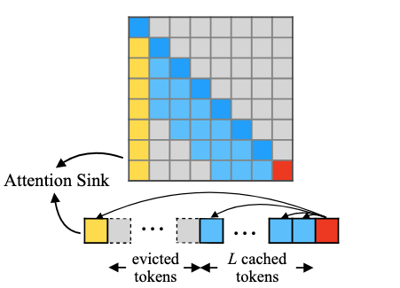
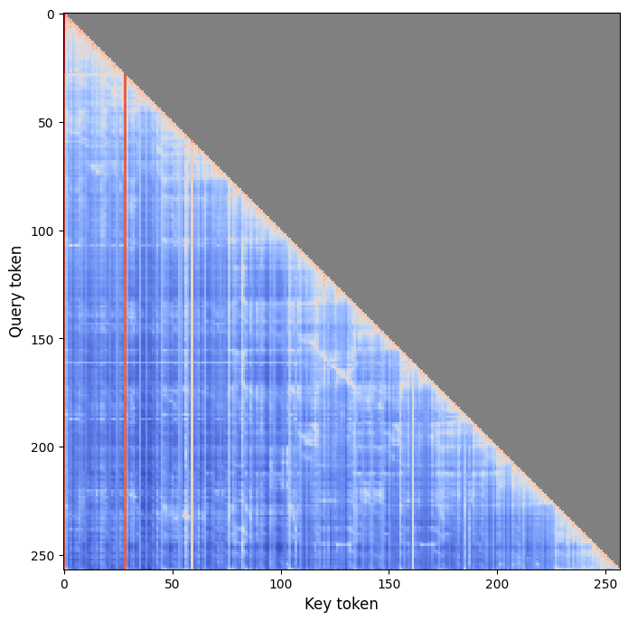
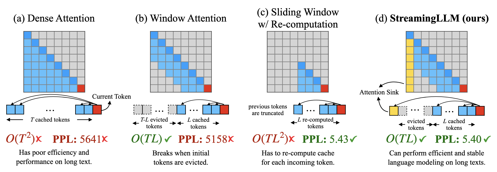
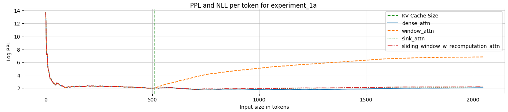
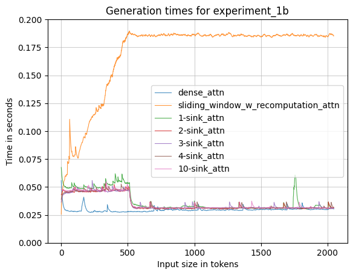
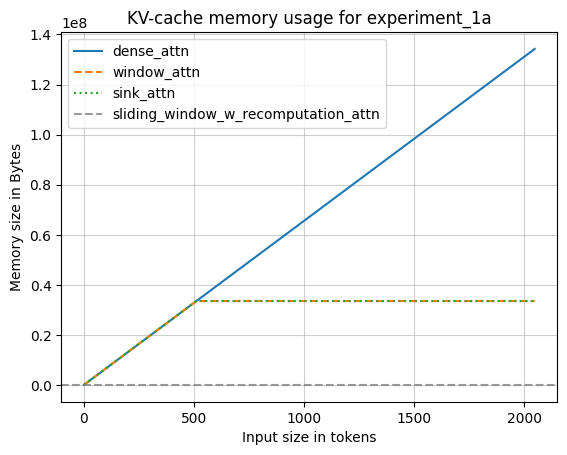
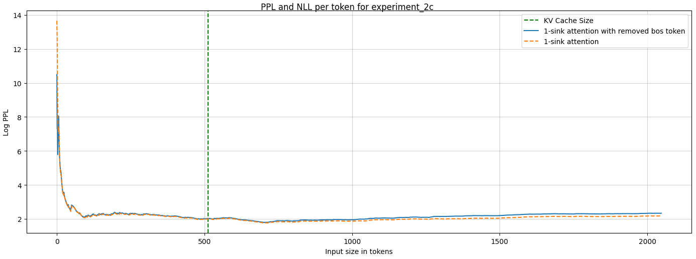
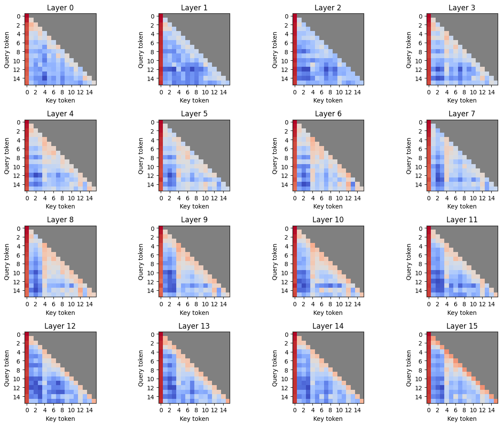
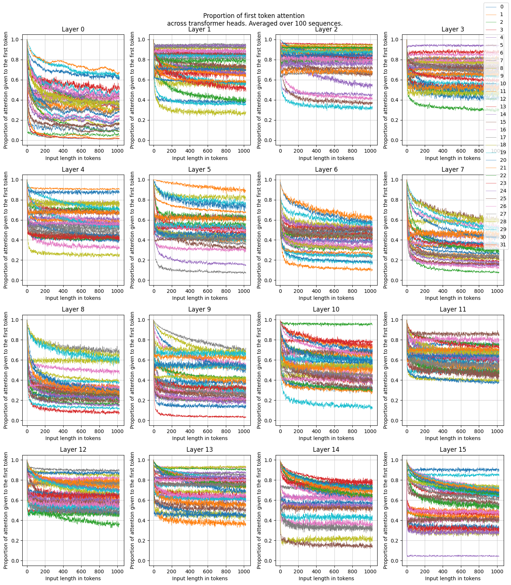

# Mini Project: Understanding Attention Sinks in Large Language Models

[](https://www.python.org/downloads/)
[](https://pytorch.org/)
[](https://huggingface.co/transformers/)

## Overview

This project investigates the phenomenon of **attention sinks** in Large Language Models (LLMs), a critical finding that affects efficient inference through Key-Value (KV) caching. Attention sinks refer to specific tokens (typically the initial tokens in a sequence) that consistently receive disproportionate attention scores, serving as "attention dumps" due to the softmax operation in the attention mechanism. 

In the later part of the study, we explore the **hypothesis that while tokens of low-semantic meaning (e.g. '*,*' or '*the*') may seem irrelevant for high performance on downstream tasks, they may be critical for the correct inner workings of the model, serving as attention sinks**.
<div align="center">
    <table>
        <tr>
            <td align="center">
                
                <br>
                <em>Attention Sink mechanism. <br>Figure from <a href=https://arxiv.org/abs/2309.17453>Xiao et al., https://arxiv.org/abs/2309.17453</a></em>
            </td>
            <td align="center">
                
                <br>
                <em>Sometimes, secondary sinks form at positions of tokens <br> with low-semantic meaning. (Shown as vertical bars)</em>
            </td>
        </tr>
    </table>
</div>


## Background & Motivation

Recent work by Xiao et al. revealed that removing initial tokens from the KV cache causes significant performance degradation in LLMs. This occurs because these tokens serve as "attention sinks" - positions where the attention mechanism allocates scores that would otherwise be distributed elsewhere due to the softmax normalization requirement.

Our research extends beyond simple reproduction to investigate:
- **Practical implications**: Importance in KV caching for efficient inference
- **Theoretical understanding**: Root causes and mechanisms behind attention sinks
- **Novel insights**: Secondary attention sinks, their relationship to token semantics and influence on downstream task performance

## Key Contributions

1. **Implementation of Sink Attention for Llama 3.2-1B**: From-scratch implementation of sink attention mechanism with positional encoding shifts
2. **Comprehensive Attention Mechanism Comparison**: Evaluation of dense, window, sliding window, and sink attention approaches
3. **Ablation Studies**: Investigation of individual components (sink tokens vs. positional encoding shifts)
4. **Discovery of Secondary Sinks**: Analysis of attention distribution beyond initial tokens
5. **Semantic Analysis**: Investigation of relationship between token semantic meaning and attention sink behavior

## Experimental Design

### Models Used
- **Llama 3.2-1B**: Primary model for experiments (131K context window, scaled RoPE)
- **Llama 2-7B**: Secondary validation model (4K context window, RoPE)

Both models use Rotary Positional Embeddings (RoPE) and Group-Query Attention (GQA), making them compatible with sink attention implementations.

### Attention Mechanisms Implemented

<p align="center">
  
  <br>
  <em>Figure from <a href=https://arxiv.org/abs/2309.17453>Xiao et al., https://arxiv.org/abs/2309.17453</a></em>
</p>

1. **Dense Attention**: Infinite KV cache capacity
2. **Window Attention**: Finite cache with LRU eviction policy
3. **Sliding Window**: No caching, recomputation over fixed window
4. **Sink Attention**: Finite cache preserving initial tokens + positional encoding shifts

## Key Findings

### Experiment 1: Attention Mechanism Comparison
- **Sink attention significantly outperforms window attention** when cache capacity is exceeded
- **Optimal sink count**: 4 tokens provide best performance balance
- **Context extension**: Successfully enables generation beyond model's training context window

<p align="center">
  
  <br>
  <em>Sink Attention allows infinite sequence decoding...</em>
</p>

<div align="center">
    <table>
        <tr>
            <td align="center">
                
                <br>
                <em>...with comparable time to dense implementation...</em>
            </td>
            <td align="center">
                
                <br>
                <em>...but constant KV-cache size</em>
            </td>
        </tr>
    </table>
</div>


### Experiment 2: Component Ablation
- **Both components crucial**: Sink tokens AND positional encoding shifts are necessary for optimal performance
- **Position vs. Token ID independence**: Neither positional encodings nor specific token IDs determine sink behavior
- **Training methodology influence**: Attention sinks emerge from pre-training patterns rather than architectural constraints

<p align="center">
   token does not alter the emergence of attention sinks" width="700"/>
  <br>
  <em>Replacing the &ltbos&gt token does not alter the emergence of attention sinks</em>
</p>

### Experiment 3: Secondary Attention Sinks Analysis
- **Massive activations discovered**: Up to 50% of attention is "wasted" across heads and layers
- **Token-type correlation**: Secondary sinks often occur at low-semantic tokens (punctuation, articles)
- **Performance impact**: Contrary to hypothesis, removing random tokens hurts performance more than removing high-attention low-semantic tokens

<div align="center">
    <table>
        <tr>
            <td align="center">
                
                <br>
                <em>Attention maps across all layers display the emergence of attention sinks</em>
            </td>
            <td align="center">
                
                <br>
                <em>Studying the proportions of "wasted" attention in each layer shows differences across the model</em>
            </td>
        </tr>
    </table>
</div>


## Results Summary

The hypothesis **does not** seem to hold in evaluated models and scenarios. 

### MMLU Benchmark Results
Evaluation on reasoning tasks shows nuanced effects of token manipulation:

| Condition            | Original | Removed 10 Low-Semantic | Removed 10 Random | Added 10 Low-Semantic |
|----------------------|----------|-------------------------|-------------------|-----------------------|
| **Overall Accuracy** | 0.3675   | 0.3366                  | 0.2735            | 0.3373                |
| **Humanities**       | 0.3507   | 0.3282                  | 0.2935            | 0.3277                |
| **STEM**             | 0.3203   | 0.2994                  | 0.2429            | 0.2892                |
| **Social Sciences**  | 0.3988   | 0.3536                  | 0.2873            | 0.3578                |
| **Other**            | 0.4100   | 0.3705                  | 0.2607            | 0.3801                |

**Key Insight**: Random token removal impacts performance more severely than removing low-semantic tokens, challenging initial hypotheses about the importance of secondary attention sinks.

## Technical Implementation

### Sink Attention Forward Pass
The implementation modifies the standard Llama attention mechanism to:
1. Store keys without positional encodings in the cache
2. Recompute RoPE for the entire sequence during each forward pass
3. Maintain initial tokens while evicting middle tokens when cache capacity is exceeded
4. Shift positional encodings to simulate continuous sequence positioning

### Novel Modifications
- Custom attention forward pass for Llama architecture
- Integration with transformers library caching system
- Support for variable sink counts and cache sizes
- Evaluation framework for multiple attention mechanisms

## Repository Structure

```
├── main.ipynb             # Complete experimental notebook
├── requirements.txt       # Python dependencies
├── results.txt            # MMLU benchmark results
├── img/                   # Visualization assets
└── README.md              # This file
```

## Installation & Usage

### Prerequisites
```bash
# Clone the repository
git clone git@github.com:TheRootOf3/L46-mini-project.git
cd L46-mini-project

# Install dependencies
pip install -r requirements.txt
```

### Model Setup
Download the required models:
- Llama 3.2-1B: Available through Hugging Face
- Llama 2-7B: Available through Hugging Face (optional, for validation)

### Running Experiments
Open and execute `main.ipynb` in Jupyter Lab/Notebook. The notebook is structured in four main sections:
1. **Preliminaries**: Model loading and KV caching demonstration
2. **Experiment 1**: Attention mechanism comparison and sink count optimization
3. **Experiment 2**: Ablation studies on sink attention components
4. **Experiment 3**: Secondary attention sinks and semantic analysis

## Future Work

1. **Scaling Studies**: Extend analysis to larger models (7B+, 70B+ parameters)
2. **Vision Transformers**: Investigate attention sinks in computer vision models
3. **Edge Deployment**: Optimize sink attention for resource-constrained environments
4. **Framework Integration**: Improve sink attention support in popular ML frameworks
5. **Mechanistic Understanding**: Deeper investigation into why certain tokens become sinks

## Related Work & References

- **Primary Reference**: [Efficient Streaming Language Models with Attention Sinks](https://arxiv.org/abs/2309.17453) - Xiao et al.
- **Massive Activations**: [Massive Activations in Large Language Models](https://arxiv.org/abs/2402.17762) - Sun et al.
- **Empirical Analysis**: [When Attention Sink Emerges in Language Models: An Empirical View](https://arxiv.org/abs/2410.10781) - Gu et al.
- **Attention Mechanics**: [Attention is Off By One](https://www.evanmiller.org/attention-is-off-by-one.html) - Evan Miller

## Citation

If you use this study in your work, please cite:

```bibtex
@misc{l46_attention_sinks,
  title={Understanding Attention Sinks in Large Language Models: An Empirical Investigation},
  author={Andrzej Szablewski},
  year={2024},
  url={https://github.com/TheRootOf3/L46-mini-project}
}
```

## License

This project is released under the MIT License. See LICENSE file for details.

## Contact

For questions or collaboration opportunities, please open an issue or contact as3623@cam.ac.uk.

---

*This project was completed as part of the Cambridge MPhil in ACS, L46 course requirements, investigating fundamental mechanisms in transformer-based language models.*
